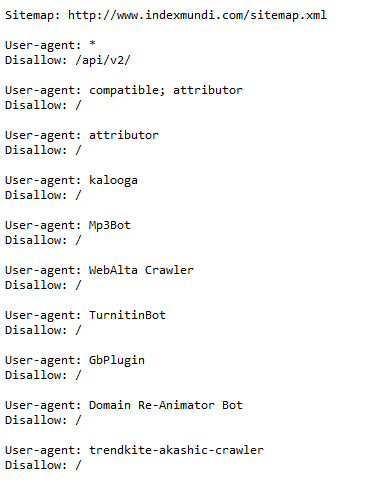

# Tipología y ciclo de vida de los datos

## Práctica 1: ¿Cómo podemos capturar los datos de la web?

### Aula 1
### Miguel Martínez Ruíz y Miguel Lima Medín

\newpage

# Índice de Contenidos

- [Contexto](#contexto)
- [Título](#título)
- [Descripción del Dataset](#descripción-del-dataset)
- [Representación Gráfica](#representación-gráfica)
- [Contenido](#contenido)
- [Propietario](#propietario)
- [Inspiración](#inspiración)
- [Licencia](#licencia)
- [Código](#código)
- [Dataset](#dataset)
- [Vídeo](#vídeo)

\newpage

## Contexto
### Recargos de metales 
En la industria de la fundición de metales es común aplicar recargos de metal (metal surcharge). Su propósito es desvincular la fluctuación del precio de mercado de una materia prima del precio negociado. La parte compradora y vendedora acordarían un precio base y la aplicación de un recargo vinculado al precio de mercado de la materia prima subyacente.

Hay dos lados en cada recargo: el aplicador del recargo y el pagador del recargo. Una empresa puede ser pagadora de recargos en los componentes que compra a sus proveedores, y a su vez aplicadora de recargos a sus clientes al vender el producto terminado elaborado a partir de esos componentes.

El acuerdo de revisión de precios marcará una periodicidad de actualización y una fórmula de cálculo. Puede que se acuerde aplicar la actualización de precio solamente tras superar una determinada variación porcentual del precio de partida.

Cada materia prima tiene un precio marcado en un momento dado para un mercado geográfico y moneda determinada.

### El valor de negocio de contar con la información actualizada
Al pagador del recargo le va a interesar estar constantemente pendiente de la evolución del precio de la materia prima para reclamar una reducción a su proveedor cuando este baja.

Como aplicador del recargo, la empresa también debe estar alerta para subir el precio sin demora.

Incluso en los casos en los que no se cuenta con un acuerdo de revisión de precios, interesa revisar periódicamente la evolución del mercado para poder renegociar el precio inicial si las materias primas subyacentes han sufrido una variación significativa.

Por tanto, cualquier retraso en el procesamiento de esta información puede resultar en un precio subóptimo y la perdida de dinero.

### El coste de acceder periódicamente a la información
Estos serían los pasos típicos para acceder a la información de precios manualmente:
1) Abrir la página web
2) Navegar hasta el metal que se desea consultar
3) Escoger las fechas, y la moneda aplicable
4) Consultar el precio
5) Repetir pasos 2 a 4 para cada metal

Con el web scrapper diseñado se automatizarían todos estos pasos grabando la información en un fichero .csv

### Página web seleccionada
Se selecciona [Index Mundi](https://www.indexmundi.com) por contener la información que se necesita.

#### Robots.txt
Se comprueba en su fichero [robots.txt](https://www.indexmundi.com/robots.txt) que en general se permiten los web scrappers, con la salvedad de una serie de robots específicados en su lista negra. Respetaremos su limitación a descargar inormación del área /api/v2. 

### Sitemap.xml

## Título

## Descripción del Dataset

Inserta aquí la descripción del dataset.

## Representación Gráfica

Inserta aquí la representación gráfica.

## Contenido

Inserta aquí el contenido.

## Propietario

Inserta aquí la información del propietario.

## Inspiración

Inserta aquí la información de la inspiración.

## Licencia

Inserta aquí información sobre la licencia del dataset.

## Código

Inserta aquí el código utilizado en la práctica.

## Dataset

Inserta aquí la descripción del dataset utilizado en la práctica.

## Vídeo

Inserta aquí el enlace al vídeo de presentación de la práctica.
