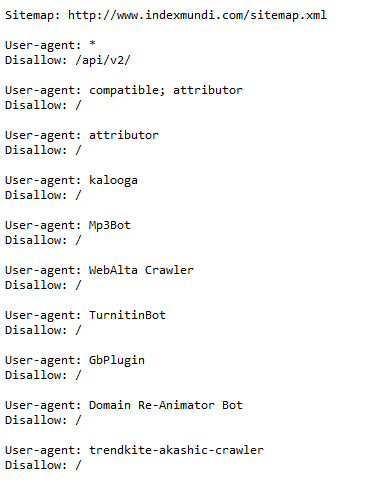
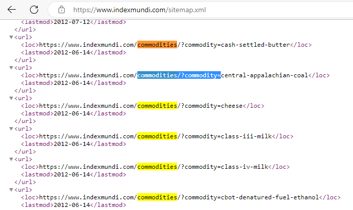
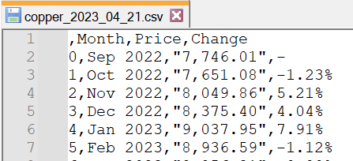
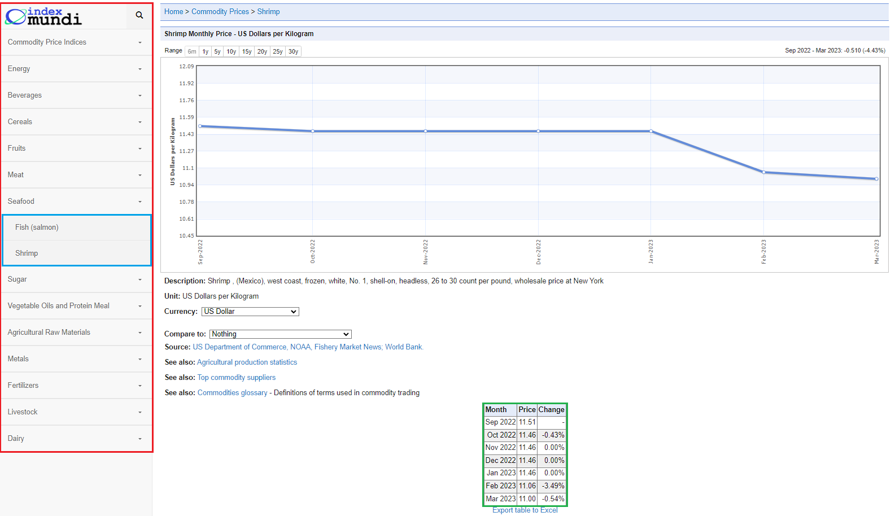
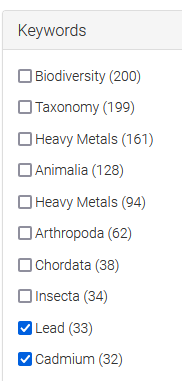
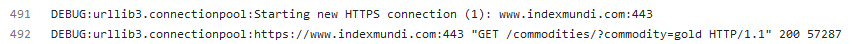
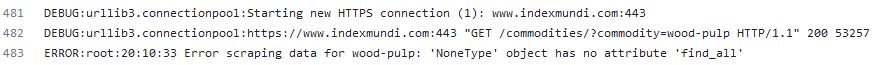
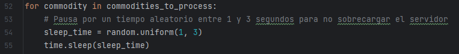
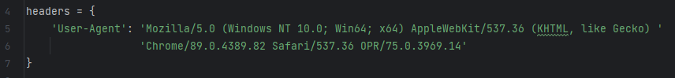

# Tipología y ciclo de vida de los datos

## Práctica 1: ¿Cómo podemos capturar los datos de la web?

### Aula 1
### Miguel Martínez Ruíz y Miguel Lima Medín

***

# Índice de Contenidos

- [Contexto](#contexto)
- [Título](#título)
- [Descripción del Dataset](#descripción-del-dataset)
- [Representación Gráfica](#representación-gráfica)
- [Contenido](#contenido)
- [Propietario](#propietario)
- [Inspiración](#inspiración)
- [Licencia](#licencia)
- [Código](#código)
- [Dataset](#dataset)
- [Vídeo](#vídeo)

****

## Contexto
### Recargos de metales 
En la industria de la fundición de metales es común aplicar recargos de metal (metal surcharge). Su propósito es desvincular la fluctuación del precio de mercado de una materia prima del precio negociado. La parte compradora y vendedora acordarían un precio base y la aplicación de un recargo vinculado al precio de mercado de la materia prima subyacente.

Hay dos lados en cada recargo: el aplicador del recargo y el pagador del recargo. Una empresa puede ser pagadora de recargos en los componentes que compra a sus proveedores, y a su vez aplicadora de recargos a sus clientes al vender el producto terminado elaborado a partir de esos componentes.

El acuerdo de revisión de precios marcará una periodicidad de actualización y una fórmula de cálculo. Puede que se acuerde aplicar la actualización de precio solamente tras superar una determinada variación porcentual del precio de partida.

Cada materia prima tiene un precio marcado en un momento dado para un mercado geográfico y moneda determinada.

### El valor de negocio de contar con la información actualizada
Al pagador del recargo le va a interesar estar constantemente pendiente de la evolución del precio de la materia prima para reclamar una reducción a su proveedor cuando este baja.

Como aplicador del recargo, la empresa también debe estar alerta para subir el precio sin demora.

Incluso en los casos en los que no se cuenta con un acuerdo de revisión de precios, interesa revisar periódicamente la evolución del mercado para poder renegociar el precio inicial si las materias primas subyacentes han sufrido una variación significativa.

Por tanto, cualquier retraso en el procesamiento de esta información puede resultar en un precio subóptimo y la perdida de dinero.

### El coste de acceder periódicamente a la información
Estos serían los pasos típicos para acceder a la información de precios manualmente:
1) Abrir la página web
2) Navegar hasta el metal que se desea consultar
3) Escoger las fechas, y la moneda aplicable
4) Consultar el precio
5) Repetir pasos 2 a 4 para cada metal

Con el web scrapper diseñado se automatizarían todos estos pasos grabando la información en un fichero .csv

### Página web seleccionada
Se selecciona [Index Mundi](https://www.indexmundi.com) por contener la información que se necesita.

#### Robots.txt
Se comprueba en su fichero [robots.txt](https://www.indexmundi.com/robots.txt) que en general se permiten los web scrappers, con la salvedad de una serie de robots específicados en su lista negra. Respetaremos la limitación indicada, no accediendo al área /api/v2.

### Sitemap.xml
Verificamos el fichero [Sitemap.xml](https://www.indexmundi.com/sitemap.xml)

Identificamos la nomenclatura de las páginas que nos interesa extraer para obtener la información de las commodities:

## Título
**Histórico de precios de materiales base**

## Descripción del Dataset
El Dataset consta de información de precios para varias commodities.

### Commodities extraidas
Las commodities a extraer son seleccionadas por el usuario o usuaria:

A) Si se indica una lista de commodities deseadas se extraerán exactamente esas commodities

B) Por defecto el programa toma la lista "commodities_list.txt" en la carpeta donde se encuentra main.py

C) También se pueden pedir todas las commodities que el web scrapper encuentre en el menú a través de BeautifulSoup, con la opción --download_from_menu

D) También se pueden pedir todas las commodities que el web scrapper encuentre en sitemap.xml, con la opción --download_from_sitemap

### Estructura de carpetas y ficheros
Existe una carpeta para cada día en el que se ha ejecutado el script, en [../dataset/](https://github.com/miguel-lima-medin/UoC-Tipologia-PRA1/tree/main/dataset). Dentro de esa carpeta existe un fichero .csv para cada commodity.

Cada fichero tiene la siguiente estructura:

1) Una primera fila de cabecera con el nombre de las tres columnas Month, Price y Change

2) Una fila para cada registro mensual

El formato es el de un texto plano separado por comas:

## Representación Gráfica

En la imagen podemos ver la estructura de la página web elegida.  
En el cuadro rojo se pueden observar los índices.  
Dentro de estos (cuadro azul) se encuentran  los subíndices con los que accedemos 
a las páginas que contienen los datos de las commodities.  
Al acceder a uno de estos, en la página contamos con la tabla (cuadro verde)
de la que extraemos la información que guardamos en el dataset.
De esta forma, nuestro dataset contará con un archivo CSV con los datos de esta 
tabla para cada commodity. Si no hubiera tabla, registramos un log con este hecho.
Estos datos se guardan en una carpeta correspondiente a la fecha de ejecución de 
nuestro programa.

## Contenido

En nuestro dataset incluimos en cada archivo, los datos del precio de la commodity 
para cada mes en un periodo de seis meses, así como el cambio porcentual del precio
respecto al mes anterior.

## Propietario

[IndexMundi](https://www.indexmundi.com/about.html) es un portal de datos que recopila hechos y estadísticas de múltiples fuentes.

Buscamos en Zenodo contenido sobre precios de metales. Restringimos la busqueda a nuestro dominio:

Se revisan los títulos y descripción de los 51 resultados, pero ninguno encaja con lo que se pretende.

Buscando datasets abiertos de "_commodities prices_" resultan 275 entradas. Revisadas todas, solo se identifican dos análisis similares a nuestro ejercicio:

| Dataset Candidato                                                                            | Análisis                                                                                                                                                                                                                               |
|----------------------------------------------------------------------------------------------|----------------------------------------------------------------------------------------------------------------------------------------------------------------------------------------------------------------------------------------|
| [Evolució del preu de les matèries primeres](https://zenodo.org/record/7336214#.ZEQxas5ByUk) | Toma tambien los datos de IndexMundi Contiene información sobre todo tipo de materias primas, pero no está actualizado En nuestro caso no necesitamos extraer algunos de los campos que se escogieron en este análisis previo. |
| [Practica 1 Web Scraping Oil Price Data](https://zenodo.org/record/5655519#.ZEQxd85ByUk)     | Solo incluye el precio de petroleo                                                                                                                                                                                                     |

## Inspiración

Inserta aquí la información de la inspiración.

## Licencia

Inserta aquí información sobre la licencia del dataset.

## Código

### Módulos

En nuestra estructura de código, hemos separado las funcionalidades del 
software en tres archivos diferentes:
- **main.py**: archivo principal, que contiene la configuración de los argumentos con los que podemos ejecutar la función principal.  
Dependiendo de estos parámetros, realizaremos el proceso de web scraping, a partir del sitemap, 
del índice del sitio web, o de una lista de commodities incluidas en un archivo de texto.
De cara a evitar posibles bloqueos de IP, realizaremos un retardo aleatorio entre cada petición al sitio web.
- **read_available_commodities**: en este archivo definimos las dos funciones que se pueden ejecutar a través de los argumentos 
que le pasamos a la función main.py (obtener la lista de commodities a procesar desde el sitemap o bien desde el menú del índice).
- **extract_data_material.py**: contiene la función a la que llamamos desde el archivo main, que realiza propiamente el proceso de 
web scraping. En concreto, busca la tabla que contiene los datos de la commodity, y los devuelve en formato dataframe.

### Dificultades enfrentadas

El sitemap.xml no estaba actualizado, así que creamos una segunda función que descubre las páginas enlazadas en el site.

Algunas páginas no contenían la tabla de información, así que se habilitó la gestión de errores para capturar ese fallo en el fichero de log  y que el código continúe su ejecución.

### Estructura logs
En la carpeta ../logs/ se guarda un fichero log para cada día. Multiples ejecuciones en un mismo día añaden líneas al fichero ya existente.

Se registra en el log tanto las páginas procesadas correctamente

como aquellas en las que se ha producido algún error

### Consideraciones código

| Indicación                                                         | Aplicación                                                                                                                                                                                |
|--------------------------------------------------------------------|-------------------------------------------------------------------------------------------------------------------------------------------------------------------------------------------|
| Descubrimiento de enlaces y navegación autónoma                    | Creadas dos funciones de navegación autónoma para obtener el listado de URLs a procesar: 1) Explorando el contenido de sitemap.xml 2) Navegando el menú lateral con BeautifulSoup |
| Mecanismos que permitan ejecutar un uso apropiado del web scraping | Parada de un tiempo aleatorio entre 1 y 3 segundos entre cada página a procesar                                                                                |
| User-Agent                                                         |                                                                                                                                                                    |
| APIs                                                               | No se utilizan                                                                                                                                                                            |
| Modularidad                                                        | Fichero main. Dos ficheros .py adicionals con 2 y 1 funciones.                                                                                                                            |

### Consideraciones página web 
| Indicación     | Aplicación |
|----------------|----------|
| Idioma         | Inglés   |
| [x] Sitio real |          |

## Dataset

Inserta aquí la descripción del dataset utilizado en la práctica.

## Vídeo

Inserta aquí el enlace al vídeo de presentación de la práctica.

### Bibliografía utilizada
● Subirats, L., Calvo, M. (2018). Web Scraping. Editorial UOC.
● Masip, D. (2019). El lenguaje Python. Editorial UOC.
● Lawson, R. (2015). Web Scraping with Python. Packt Publishing Ltd. Chapter 2.
Scraping the Data.
● Tutorial de GitHub https://guides.github.com/activities/hello-world.
- Herramienta Learn de PyCharm

### Tabla de firmas
Ambos hemos contribuido en cada uno de los apartados.

| Contribuciones | Firma Martínez | Firma Lima |
|------|----------------|------------|
| Investigación previa     | mmr              | mlm        |
| Redacción de las respuestas     | mmr               | mlm        |
| Desarrollo del código      | mmr               | mlm        |
| Participación en el vídeo     | mmr               | mlm        |
