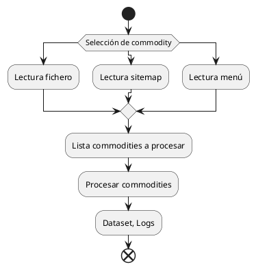
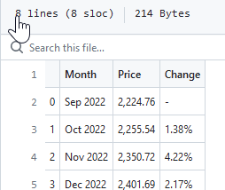
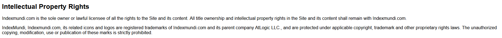

# Tipología y ciclo de vida de los datos

## Práctica 1: ¿Cómo podemos capturar los datos de la web?

### Aula 1
### Miguel Martínez Ruíz y Miguel Lima Medín

# Índice de Contenidos

- [Contexto](#contexto)
- [Título](#título)
- [Descripción del Dataset](#descripción-del-dataset)
- [Representación Gráfica](#representación-gráfica)
- [Contenido](#contenido)
- [Propietario](#propietario)
- [Inspiración](#inspiración)
- [Licencia](#licencia)
- [Código](#código)
- [Dataset](#dataset)
- [Vídeo](#vídeo)

## Contexto
Decidimos trabajar sobre la información de precios de commodities, más concretamente los metales básicos, en el contexto de la industria de la automoción. Se desarrolla el caso de negocio en más detalle en el capítulo _Inspiración_ de esta memoria.

### Página web seleccionada
Se selecciona [Index Mundi](https://www.indexmundi.com) por contener la información que se necesita.

#### Sitemap.xml
Verificamos el fichero [Sitemap.xml](https://www.indexmundi.com/sitemap.xml)

Identificamos la nomenclatura de las páginas que nos interesa extraer para obtener la información de las commodities:

## Título del Dataset
**Histórico de precios de materiales base**

## Descripción del Dataset
El Dataset consta de información de precios para varias commodities.

### Commodities extraidas
Las commodities a extraer son seleccionadas por el usuario o usuaria:

A) Si se indica una lista de commodities deseadas se extraerán exactamente esas commodities

B) Por defecto el programa toma la lista "commodities_list.txt" en la carpeta donde se encuentra main.py

C) También se pueden pedir todas las commodities que el web scrapper encuentre en el menú a través de BeautifulSoup, con la opción --download_from_menu

D) También se pueden pedir todas las commodities que el web scrapper encuentre en sitemap.xml, con la opción --download_from_sitemap

## Representación Gráfica

### Diagrama de flujo del proceso

### Captura de pantalla de la web

En la imagen podemos ver la estructura de la página web elegida.  
En el cuadro rojo se pueden observar los índices.  
Dentro de estos (cuadro azul) se encuentran  los subíndices con los que accedemos 
a las páginas que contienen los datos de las commodities.  
Al acceder a uno de estos, en la página contamos con la tabla (cuadro verde)
de la que extraemos la información que guardamos en el dataset.
De esta forma, nuestro dataset contará con un archivo CSV con los datos de esta 
tabla para cada commodity. Si no hubiera tabla, registramos un log con este hecho.
Estos datos se guardan en una carpeta correspondiente a la fecha de ejecución de 
nuestro programa.

## Contenido

En nuestro dataset incluimos en cada archivo, los datos del precio de la commodity 
para cada mes en un periodo de seis meses, así como el cambio porcentual del precio
respecto al mes anterior.

### Estructura de carpetas y ficheros
Existe una carpeta para cada día en el que se ha ejecutado el script, en [../dataset/](https://github.com/miguel-lima-medin/UoC-Tipologia-PRA1/tree/main/dataset). Dentro de esa carpeta existe un fichero .csv para cada commodity.

Cada fichero tiene la siguiente estructura:

1) Una cabecera con el nombre de las tres columnas Month, Price y Change

2) Una fila para cada registro mensual

El formato es el de un texto plano separado por comas:

## Propietario

### Presentación del propietario
[IndexMundi](https://www.indexmundi.com/about.html) es un portal de datos que recopila hechos y estadísticas de múltiples fuentes.

### Investigación de análisis anteriores
Buscamos en Zenodo contenido sobre precios de metales. Restringimos la busqueda a nuestro dominio:

Se revisan los títulos y descripción de los 51 resultados, pero ninguno encaja con lo que se pretende.

Buscando datasets abiertos de "_commodities prices_" resultan 275 entradas. Revisadas todas, solo se identifican dos análisis similares a nuestro ejercicio:

| Dataset Candidato                                                                            | Análisis                                                                                                                                                                                                                               |
|----------------------------------------------------------------------------------------------|----------------------------------------------------------------------------------------------------------------------------------------------------------------------------------------------------------------------------------------|
| [Evolució del preu de les matèries primeres](https://zenodo.org/record/7336214#.ZEQxas5ByUk) | Toma tambien los datos de IndexMundi Contiene información sobre todo tipo de materias primas, pero no está actualizado En nuestro caso no necesitamos extraer algunos de los campos que se escogieron en este análisis previo. |
| [Practica 1 Web Scraping Oil Price Data](https://zenodo.org/record/5655519#.ZEQxd85ByUk)     | Solo incluye el precio de petroleo                                                                                                                                                                                                     |

### Principios éticos y legales
Listamos una serie de principios que se deben considerar antes de proceder con web scrapping, y como los hemos tenido en cuenta en nuestro ejercicio.

#### Obtener permiso y respetar indicaciones del propietario
Se comprueba en su fichero [robots.txt](https://www.indexmundi.com/robots.txt) que en general se permiten los web scrappers, con la salvedad de una serie de robots específicados en su lista negra. Respetaremos la limitación indicada, no accediendo al área /api/v2.

#### Respeto de los derechos de autoría
El sitio web [indexmundi.com](https://www.indexmundi.com/) es el único propietario de todos los derechos sobre el sitio y su contenido, incluyendo las marcas registradas y los derechos de propiedad intelectual. Por lo tanto, cualquier uso no autorizado de su contenido podría constituir una violación de los derechos de propiedad intelectual y estar sujeto a sanciones legales. 

En este caso particular, dado que el dataset generado es para uso privado y no se va a comercializar, se podría argumentar que se está respetando el derecho de autor.

Al no contar con su consentimiento explicito, y no ser necesario para nuestro ejercicio, hemos evitado la reproducción o uso de sus logotipos y marcas registradas.

#### No infringir los términos de servicio
Se consultan los términos en [https://www.indexmundi.com/help/terms/](https://www.indexmundi.com/help/terms/).

| Capítulo                                  | Título en castellano                          | Resumen consideraciones del capítulo                                                                                                                                                                                                                                                                                                     | Aplicación en nuestro ejercicio                                                                                                                                                                                                                                                                                                      |
|-------------------------------------------|-----------------------------------------------|------------------------------------------------------------------------------------------------------------------------------------------------------------------------------------------------------------------------------------------------------------------------------------------------------------------------------------------|--------------------------------------------------------------------------------------------------------------------------------------------------------------------------------------------------------------------------------------------------------------------------------------------------------------------------------------|
| Scope of the Agreement                    | Ámbito del acuerdo                            | Este capítulo indica el alcance del acuerdo de uso, que se aplica a todo usuario/a que acceda al sitio y debe ser asumido antes de empezar a usar el site.                                                                                                                                                                               | Asumimos las condiciones, que se ven en detalle en cada capítulo posterior.                                                                                                                                                                                                                                                          |
| User guidelines | Pautas del usuario/a                          | Indica pautas de uso como: - No violar leyes o acuerdos con terceros - Ser mayor de 18 años - Pautas específicas para usuarios registrados: no compartir clave, no publicar información falsa, no publicar información en áreas incorrectas, etc. - No spam ni virus - No recoger información de usuarios/as         | Cumplimos todas las pautas en nuestro ejercicio.                                                                                                                                                                                                                                                                                     |
| Registered Users                          | Usuarios/as registrados/as                    | Este capítulo se aplica a aquellos usuarios y usuarias que se han registrado en el sitio web. Contiene información sobre la veracidad de la información proporcionada por el usuario o usuaria registrada, la privacidad de los datos y las responsabilidades del usuario/a.                                                             | No nos aplica, porque no somos una empresa registrada como usuario del site que vaya a subir datos. Solo vamos a descargar datos accesibles públicamente a visitantes no registrados.                                                                                                                                                |
| Posting information on the site | Publicando información en el sitio            | Enumera 13 normas a tener en cuenta a la hora de subir contenido                                                                                                                                                                                                                                                                         | No aplica porque no subiremos contenido                                                                                                                                                                                                                                                                                              |
| Transactions between Buyers and Suppliers | Transacciones entre compradores y proveedores | Este capítulo establece los términos y condiciones para las transacciones entre compradores y proveedores a través del sitio web.                                                                                                                                                                                                        | No nos aplica.                                                                                                                                                                                                                                                                                                                       |
| Privacy                                   | Privacidad                                    | Describe la política de privacidad del sitio web y cómo se recopila, utiliza y protege la información personal del usuario. Alerta sobre el uso de cookies, en donde se almacenarán los datos y explicita que no se venderá información personal a terceros sin consentimiento previo.                                                   | Estamos de acuerdo con que almacenen en EEUU la información sobre nuestra navegación en sus cookies.                                                                                                                                                                                                                                 |
| Limitation of Liability                   | Limitación de responsabilidad                 | Este capítulo establece las limitaciones de responsabilidad del sitio web y sus propietarios en caso de daños o perjuicios causados al usuario. Básicamente no se hacen responsables por la exactitude de los datos, que deben ser usados para tomar decisiones de negocio o personales bajo la total responsabilidad de cada usuario/a. | Incluiremos una clausula de limitación de responsabilidad en nuestro dataset de Zenodo.                                                                                                                                                                                                                                              |
| Indemnity                                 | Indemnización                                 | Establece la obligación del usuario de indemnizar al sitio web y sus propietarios en caso de que se produzcan daños o perjuicios como resultado del uso del sitio web. Es importante ser cuidadoso con el web scrapper de forma a evitar perjuicios en el propietario que puedan derivar en un proceso judicial.                         | La cantidad de datos a descargar es mínima y se incluye un retraso con cada página, así que no esperamos ningún impacto en el rendimiento de la página. Ejecutaremos el código siempre en primer plano, nunca en un trabajo desatendido, para poder cancelarlo en caso de ver que causa algún problema o entra en un ciclo infinito. |
| Notices                                   | Notificaciones                                | Describe cómo se realizan las notificaciones y comunicaciones entre el usuario y el sitio web.                                                                                                                                                                                                                                           | No aplica, no somos un usuario registrado.                                                                                                                                                                                                                                                                                           |
| General                                   | General                                       | Este capítulo contiene disposiciones generales y cláusulas de cierre del acuerdo, como el derecho de IndexMundi a modificar las condiciones en un futuro sin previo aviso.                                                                                                                                                               | No debemos asumir que las condiciones son estáticas, y si en un futuro se vuelve a usar el web scrapper debemos validar periódicamente si ha habido actualizaciones en los términos de uso.                                                                                                                                          |

#### No sobrecargar ni dañar el sitio web
Tal como se ha explicado en otras partes de esta memoria la cantidad de datos a descargar es mínima y se incluye un retraso con cada página.

#### No divulgar información personal
No existe información personal en este dataset.

#### Acuerdo de privacidad
En [https://www.indexmundi.com/help/privacy/](https://www.indexmundi.com/help/privacy/) se describe la política de privacidad de IndexMundi.

En los capítulos _Collection_, _Marketing_, _Use_, _Our Disclosure of Your Information_, _Cookies_, _Account Protection_, _Accessing, Reviewing and Changing Your Personal Information_, _Security_, _Third Parties_ y _Information You Share on IndexMundi_ se explica que hacen con nuestra información. Damos validez a esa propuesta.

En el capítulo _No Spam, Spyware or Spoofing_ se nos pide que no enviemos contenido no solicitado, cosa que no haremos.

El capítulo _Using Information from IndexMundi_ es el más relevante para marcarnos que podemos hacer con la información publicada por IndexMundi. Las limitaciones que establecen se centran en los datos de otros usuarios (está más pensado para usuarios corporativos registrados que tienen acceso a los contactos de otros usuarios con los que interactuar).

#### No comercializar los datos sin autorización
No se comercializará la información.

## Inspiración

### Recargos de metales 
En la industria de la fundición de metales es común aplicar recargos de metal (metal surcharge). Su propósito es desvincular la fluctuación del precio de mercado de una materia prima del precio negociado. La parte compradora y vendedora acordarían un precio base y la aplicación de un recargo vinculado al precio de mercado de la materia prima subyacente.

Hay dos lados en cada recargo: el aplicador del recargo y el pagador del recargo. Una empresa puede ser pagadora de recargos en los componentes que compra a sus proveedores, y a su vez aplicadora de recargos a sus clientes al vender el producto terminado elaborado a partir de esos componentes.

El acuerdo de revisión de precios marcará una periodicidad de actualización y una fórmula de cálculo. Puede que se acuerde aplicar la actualización de precio solamente tras superar una determinada variación porcentual del precio de partida.

Cada materia prima tiene un precio marcado en un momento dado para un mercado geográfico y moneda determinada.

### El valor de negocio de contar con la información actualizada
Al pagador del recargo le va a interesar estar constantemente pendiente de la evolución del precio de la materia prima para reclamar una reducción a su proveedor cuando este baja.

Como aplicador del recargo, la empresa también debe estar alerta para subir el precio sin demora.

Incluso en los casos en los que no se cuenta con un acuerdo de revisión de precios, interesa revisar periódicamente la evolución del mercado para poder renegociar el precio inicial si las materias primas subyacentes han sufrido una variación significativa.

Por tanto, cualquier retraso en el procesamiento de esta información puede resultar en un precio subóptimo y la perdida de dinero.

### El coste de acceder periódicamente a la información
Estos serían los pasos típicos para acceder a la información de precios manualmente:
1) Abrir la página web
2) Navegar hasta el metal que se desea consultar
3) Escoger las fechas, y la moneda aplicable
4) Consultar el precio
5) Repetir pasos 2 a 4 para cada metal

Con el web scrapper diseñado se automatizarían todos estos pasos grabando la información en un fichero .csv

## Licencia
Decidimos utilizar una licencia [Creative Commons](https://creativecommons.org) por ser uno de los modelos más reconocidos y aceptados. Las condiciones son muy claras, y es fácilmente reconocible por la mayoría de las personas.

Utilizamos la herramienta de selección de licencias de su site para escoger la más apropiada: [https://creativecommons.org/choose/](https://creativecommons.org/choose/)

 Esta obra está bajo una <a rel="license" href="http://creativecommons.org/licenses/by-nc/4.0/">licencia de Creative Commons Reconocimiento-NoComercial 4.0 Internacional</a>.

## Código

### Módulos

En nuestra estructura de código, hemos separado las funcionalidades del 
software en tres archivos diferentes:
- **main.py**: archivo principal, que contiene la configuración de los argumentos con los que podemos ejecutar la función principal.  
Dependiendo de estos parámetros, realizaremos el proceso de web scraping, a partir del sitemap, 
del índice del sitio web, o de una lista de commodities incluidas en un archivo de texto.
De cara a evitar posibles bloqueos de IP, realizaremos un retardo aleatorio entre cada petición al sitio web.
- **read_available_commodities**: en este archivo definimos las dos funciones que se pueden ejecutar a través de los argumentos 
que le pasamos a la función main.py (obtener la lista de commodities a procesar desde el sitemap o bien desde el menú del índice).
- **extract_data_material.py**: contiene la función a la que llamamos desde el archivo main, que realiza propiamente el proceso de 
web scraping. En concreto, busca la tabla que contiene los datos de la commodity, y los devuelve en formato dataframe.

### Dificultades enfrentadas

El sitemap.xml no estaba actualizado, así que creamos una segunda función que descubre las páginas enlazadas en el site.

Algunas páginas no contenían la tabla de información, así que se habilitó la gestión de errores para capturar ese fallo en el fichero de log  y que el código continúe su ejecución.

### Estructura logs
En la carpeta ../logs/ se guarda un fichero log para cada día. Multiples ejecuciones en un mismo día añaden líneas al fichero ya existente.

Se registra en el log tanto las páginas procesadas correctamente

como aquellas en las que se ha producido algún error

### Consideraciones código

| Indicación                                                         | Aplicación                                                                                                                                                                                |
|--------------------------------------------------------------------|-------------------------------------------------------------------------------------------------------------------------------------------------------------------------------------------|
| Descubrimiento de enlaces y navegación autónoma                    | Creadas dos funciones de navegación autónoma para obtener el listado de URLs a procesar: 1) Explorando el contenido de sitemap.xml 2) Navegando el menú lateral con BeautifulSoup |
| Mecanismos que permitan ejecutar un uso apropiado del web scraping | Parada de un tiempo aleatorio entre 1 y 3 segundos entre cada página a procesar                                                                                |
| User-Agent                                                         |                                                                                                                                                                    |
| APIs                                                               | No se utilizan                                                                                                                                                                            |
| Modularidad                                                        | Fichero main. Dos ficheros .py adicionals con 2 y 1 funciones.                                                                                                                            |

### Consideraciones página web 
| Indicación     | Aplicación |
|----------------|----------|
| Idioma         | Inglés   |
| [x] Sitio real |          |

## Dataset
Se puede consultar el dataset en Zenodo con el siguiente DOI: [https://doi.org/10.5281/zenodo.7856321](https://doi.org/10.5281/zenodo.7856321)

## Vídeo

Inserta aquí el enlace al vídeo de presentación de la práctica.

## Bibliografía utilizada
- Subirats, L., Calvo, M. (2018). Web Scraping. Editorial UOC.
- Masip, D. (2019). El lenguaje Python. Editorial UOC.
- Lawson, R. (2015). Web Scraping with Python. Packt Publishing Ltd. Chapter 2. Scraping the Data.
- Tutorial de GitHub https://guides.github.com/activities/hello-world.
- Herramienta Learn de PyCharm
- Documentación y ayuda de PyCharm

## Tabla de firmas
Ambos hemos contribuido en cada uno de los apartados.

| Contribuciones | Firma Martínez | Firma Lima |
|------|----------------|------------|
| Investigación previa     | mmr              | mlm        |
| Redacción de las respuestas     | mmr               | mlm        |
| Desarrollo del código      | mmr               | mlm        |
| Participación en el vídeo     | mmr               | mlm        |
